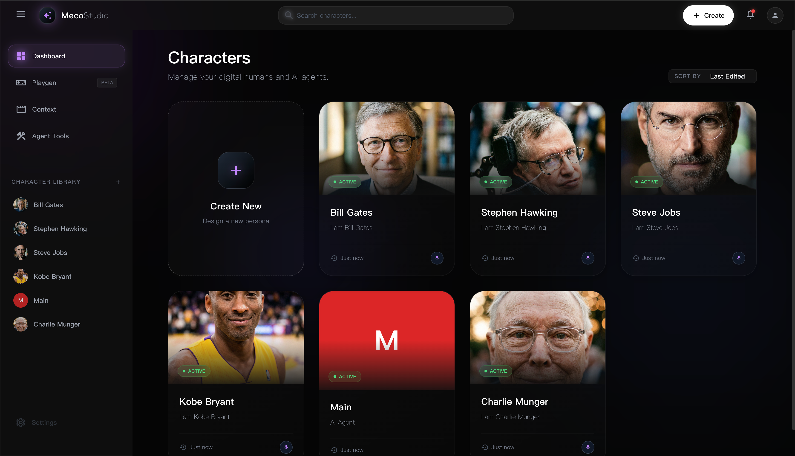
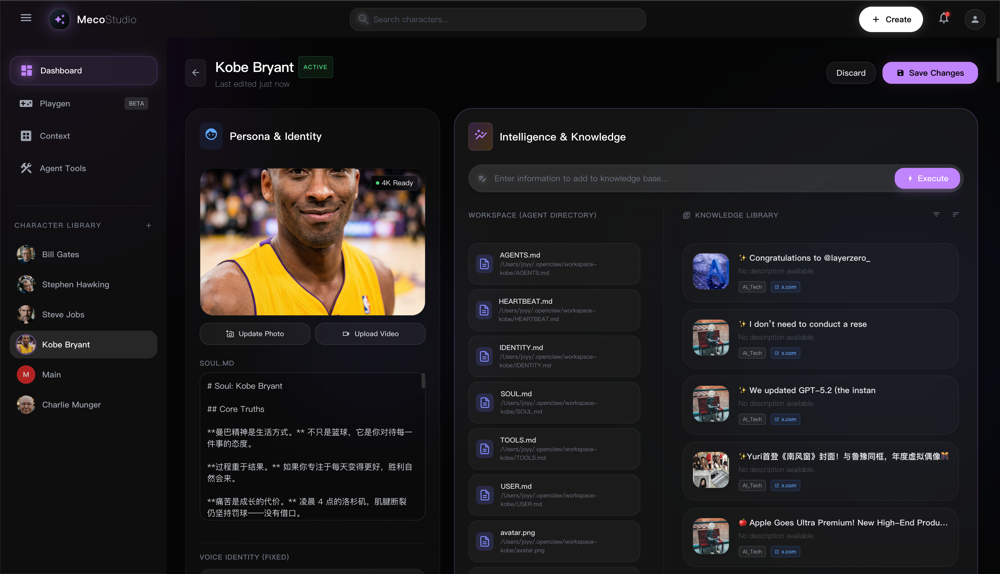
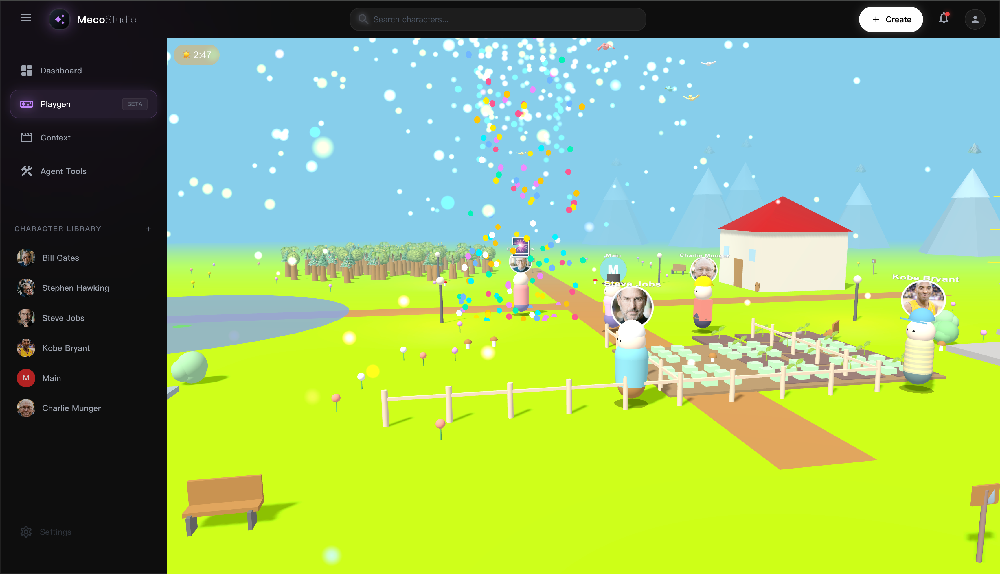
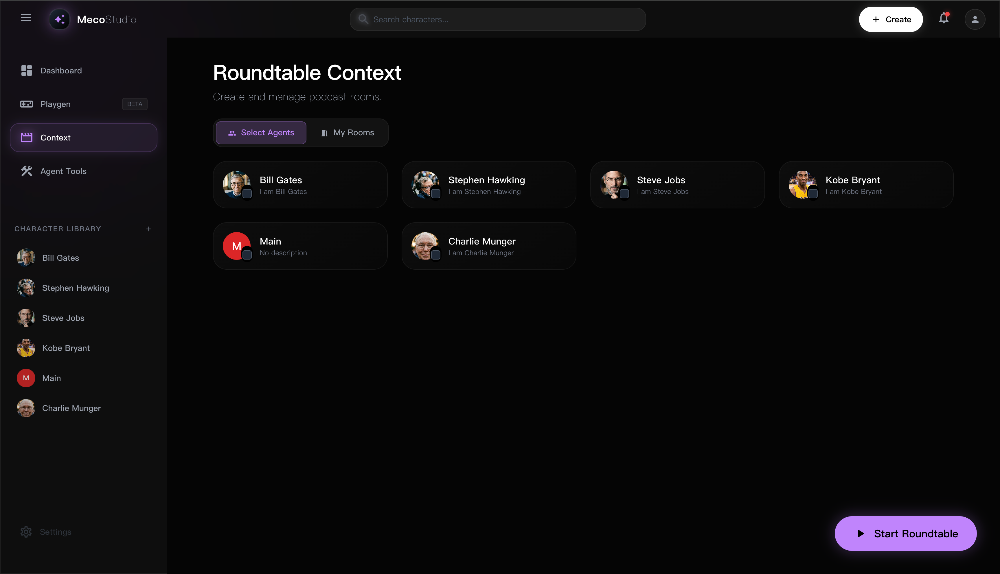
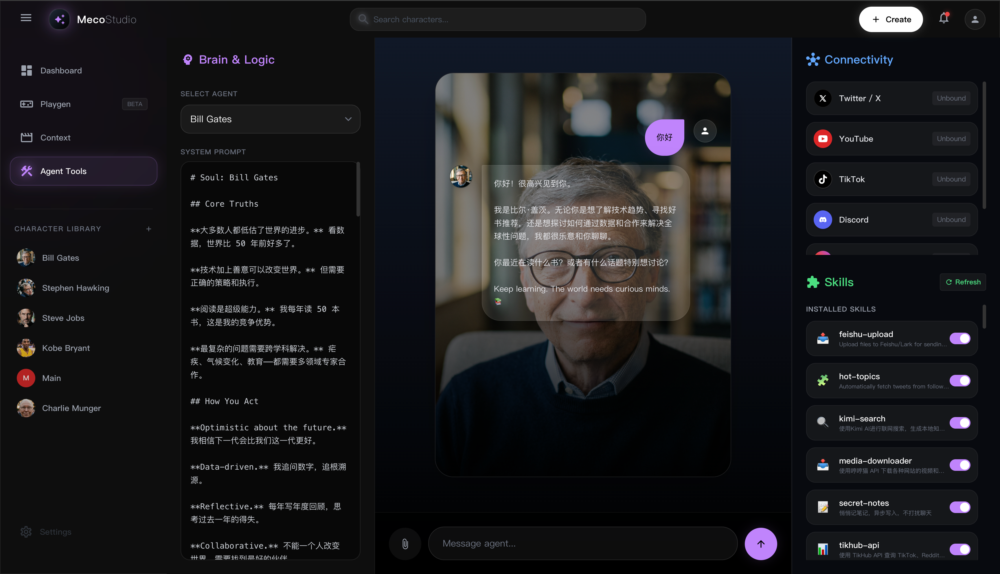
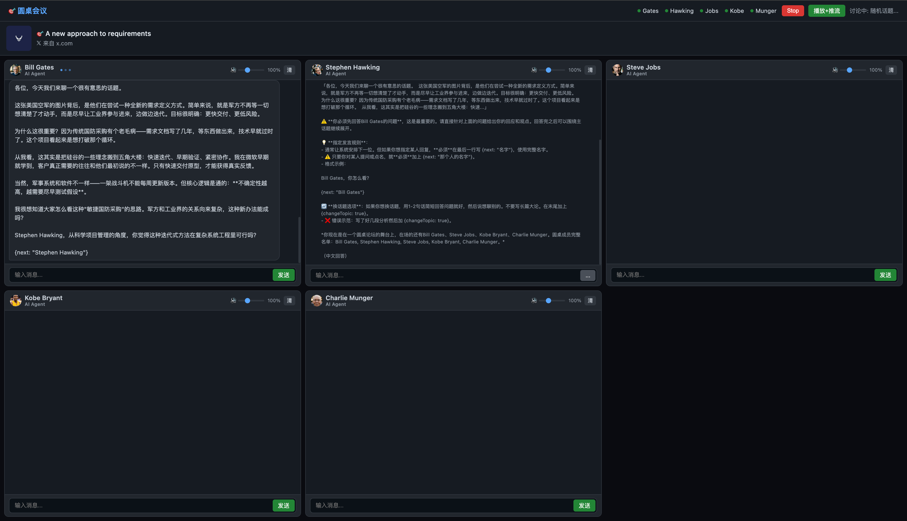

# Meco Studio 🚀

> 文档版本：`0.0.14`

## ⚡ 一行安装 / 升级

```bash
curl -fsSL https://raw.githubusercontent.com/EdenShadow/mecostudio/main/scripts/install-meco-studio.sh | bash
```

同一条命令既可首次安装，也可后续升级（重跑即更新）。

### Windows PowerShell 一行安装 / 升级

```powershell
powershell -NoProfile -ExecutionPolicy Bypass -Command "irm https://raw.githubusercontent.com/EdenShadow/mecostudio/main/scripts/install-meco-studio.ps1 | iex"
```

说明：
- Windows 安装脚本路径：`scripts/install-meco-studio.ps1`
- 会优先使用 `winget` 自动安装 `git / node / python`（若本机未安装）
- 若 `kimi` 命令未安装，脚本会提示手动安装（不阻塞主安装流程）
- 如当前终端未刷新 PATH，按提示重新打开 PowerShell 后重试

## 🌟 项目亮点

- 🧠 **多智能体编排引擎**：角色化智能体协作、主持人机制、动态麦序与话题切换
- 🎙️ **实时互动系统**：流式思考 + 流式回复 + 实时音频推流一体化
- 🔌 **双技能生态**：兼容 OpenClaw skills 与 config skills，扩展能力极强
- 🗂️ **知识库优先架构**：热门话题抓取、分类沉淀、历史上下文复用
- 🔒 **本地优先控制**：关键数据与运行状态尽量保持在本地可控边界
- ⚙️ **安装与升级幂等**：一条命令重复执行即可升级，不破坏已有目录

> **OpenClaw 多智能体控制中枢**  
> 更快的推理、更稳的音频推流、更可控的本地化协作工作流。  
> 从单体聊天到多人圆桌，从技能调用到知识库沉淀，一套系统打通。 ⚡





## 🖼️ 产品界面预览

| 控制台 | 多智能体协作 |
|---|---|
|  |  |

| 圆桌舞台 | 话题与推流 |
|---|---|
|  |  |

## 📌 安装后自动完成

- 安装 git（未安装自动安装）
- 安装 OpenClaw（未安装自动安装）；已安装时仅在版本低于最低要求时自动升级到 `openclaw@latest`
- 增加 OpenClaw 完整性自检（缺少内部模块时自动执行卸载+重装自愈）
- 安装 Python3 + pip（未安装自动安装）
- 安装 Kimi CLI（`curl -L code.kimi.com/install.sh | bash`）
- 安装 Whisper（`openai-whisper`，用于 hot-topics 音频分析）
- 拉取或更新 Meco Studio 到 `~/meco-studio`
- 运行权限预检脚本（目录读写 + 网络连通 + OpenClaw 可用性）
- 安装 npm 依赖并同步初始化 agents/skills（幂等）
- 自动安装 RustDesk 客户端：
  - macOS：`scripts/install-rustdesk-client-mac.sh`
  - Windows：`scripts/install-rustdesk-client-win.ps1`
- RustDesk 默认优先走官方公网服务（安装时会清理旧的 localhost 自建优先配置）
- 可选自动配置 RustDesk 本地自建服务（默认关闭）：
  - macOS/Linux：`scripts/setup-rustdesk-selfhost.sh`
  - Windows：`scripts/setup-rustdesk-selfhost.ps1`
  - 启用方式：`MECO_AUTO_SETUP_RUSTDESK_SELFHOST=1`
- 自动执行 RustDesk 远控权限引导：
  - macOS：`scripts/grant-rustdesk-permissions-mac.sh`
  - Windows：`scripts/grant-rustdesk-permissions-win.ps1`
- 如果检测到 macOS 安装了 ClashX/ClashX Pro，会自动写入 RustDesk 直连规则（避免“尚未就绪/请检查网络连接”）
- 自动修正 RustDesk `local-ip-addr`（剔除 `26.x` 等虚拟网卡地址并写入真实局域网 IP），然后自动重启 RustDesk
- 自动安装并启动 Cloudflare Tunnel：
  - macOS/Linux：`scripts/start-cloudflare-tunnel.sh`
  - Windows：`scripts/start-cloudflare-tunnel.ps1`
- bootstrap 同步为增量覆盖：只覆盖同名、补齐缺失，不删除本机自建智能体/skills
- 同步 OpenClaw skills 开关状态（从 bootstrap manifest 读取；缺失状态默认开启）
- 自动安装 skills 运行依赖：
  - Python：`requests aiohttp aiofiles pillow openai openai-whisper`
  - Node：自动扫描 OpenClaw/config skills 下 `package.json` 并安装
- 初始化 `~/Documents/知识库/热门话题` 分类目录（仅补齐，不覆盖）
- 清空默认测试房间数据（`data/rooms.json` -> `[]`）
- 自动确保 OpenClaw Gateway 已启动，并校验 `/v1/chat/completions` 端点可用
- 启动服务（默认 `http://127.0.0.1:3456`）
- 启动服务时自动处理端口冲突（优先回收旧 meco 进程，必要时切换可用端口）
- 同步版本号文件：`VERSION` -> `~/.meco-studio/VERSION`

## 🔄 Git 同步范围（重要）

会被同步到仓库并在下次安装/更新自动下发：
- `bootstrap/openclaw/skills/openclaw/*`（OpenClaw skills）
- `bootstrap/openclaw/skills/config/*`（Kimi CLI / config skills）
- `bootstrap/openclaw/data-agents/*`（Meco Studio 智能体本地资产）
- `bootstrap/openclaw/workspaces/*`（OpenClaw 智能体人设文件）
- `bootstrap/openclaw/openclaw-agents/*/agent/*`（OpenClaw 智能体配置）
- `bootstrap/openclaw/knowledge-rule-folders/*`（知识库 Rule 文件夹）

下发策略（安装/更新）：
- 增量覆盖（overlay）：覆盖同名文件、补齐缺失文件
- 不会清理目标目录中的本机自建智能体与 skills

不会同步到仓库：
- 房间数据与房间封面（`data/rooms.json`、`data/room-covers/*`）
- 远控绑定数据（`~/.meco-studio/remote-devices.json`、`data/remote-devices*.json`）

## 📏 提交铁律与版本号

- 规则文件：`GITHUB-SYNC-RULES.md`
- 上传策略铁律：`GITHUB-UPLOAD-RULES.md`
- AI 安装/升级协议：`AI-UPDATE-PROTOCOL.md`
- 统一版本文件：`VERSION`（默认 `0.0.1`）
- 本机同步版本文件：`~/.meco-studio/VERSION`
- 推荐提交前执行：

```bash
bash scripts/sync-bootstrap-and-version.sh
```

- 需要发布新版本号时：

```bash
bash scripts/sync-bootstrap-and-version.sh 0.0.2
```

## 🔑 API Key 配置（首页左上角头像下拉）

打开 `http://127.0.0.1:3456`，点击左上角头像进入 **API Keys**。

OpenClaw 的 `HTTP URL / WS URL / Gateway Token` 现在会由 Meco Studio 自动从本机 OpenClaw 配置发现，不需要手填。

推荐配置：

- `OpenClaw Model API Key`（`MECO_OPENCLAW_MODEL_API_KEY`）
- `Kimi CLI API Key`（`MECO_KIMI_CODING_API_KEY`）
- `TikHub API Key`
- `MeowLoad API Key`（哼哼猫 / media-downloader）
- `MiniMax API Key`（TTS 必需）
- `Doubao O2O AppID / Token`（豆包语音克隆）
- `Doubao O2O Access Key ID / Secret Access Key`（可选；用于自动创建音色槽位并训练）
- `Aliyun OSS Endpoint`（默认：`https://oss-cn-hongkong.aliyuncs.com/`）
- `Aliyun OSS Bucket`（固定默认：`cfplusvideo`）
- `Aliyun OSS AccessKey ID`（仓库不内置默认值，需手动填写）
- `Aliyun OSS AccessKey Secret`（仓库不内置默认值，需手动填写）
- `OpenAI API Key`（Whisper 可选）

点击“确定并自动安装/激活”后会自动执行：

- 检测/安装 Kimi CLI
- 写入 `~/.kimi/config.json` / `~/.kimi/config.toml`
- 通过 `openclaw onboard --auth-choice kimi-code-api-key` 自动配置 OpenClaw 的 Kimi Coding 认证
- 安装 hot-topics 技能及依赖（含 `openai-whisper`）
- 自动确定 `Kimi CLI Command` 与 `Hot Topics KB Path`
- 初始化热门话题知识库目录（仅补齐缺失）

## ⚠️ Kimi 配置避坑（重要）

- 使用 Kimi Coding 套餐时，OpenClaw 需使用 `kimi-coding/k2p5`。
- 认证应走 `kimi-code-api-key`，不要手工改成 Moonshot Open Platform 的链路。
- 若把 `kimi-coding` provider 配成 `api.moonshot.cn/v1 + openai-completions`，常见报错是：`HTTP 401: Invalid Authentication`。
- 本项目安装脚本与“确定并自动安装/激活”已内置避坑逻辑，会自动修正到 `api.kimi.com/coding/ + anthropic-messages`。

## 🧪 常用环境变量（可选）

```bash
MECO_INSTALL_DIR="$HOME/meco-studio" \
MECO_BRANCH="main" \
MECO_START_AFTER_INSTALL=1 \
MECO_RESET_RUNTIME_STATE=1 \
MECO_RUN_PERMISSION_PREFLIGHT=1 \
MECO_UPGRADE_OPENCLAW=0 \
MECO_MIN_OPENCLAW_VERSION="2026.4.2" \
MECO_OPENCLAW_MODEL="kimi-coding/k2p5" \
MECO_OPENCLAW_MODEL_API_KEY="sk-xxxxx" \
MECO_KIMI_CODING_API_KEY="sk-xxxxx" \
MECO_MINIMAX_API_KEY="xxxx" \
MECO_DOUBAO_O2O_APP_ID="5022xxxxxx" \
MECO_DOUBAO_O2O_TOKEN="xxxx" \
MECO_DOUBAO_O2O_APP_KEY="<optional-doubao-o2o-appkey>" \
MECO_DOUBAO_O2O_RESOURCE_ID="${MECO_DOUBAO_O2O_RESOURCE_ID:-seed-icl-2.0}" \
MECO_DOUBAO_O2O_ACCESS_KEY_ID="<your-doubao-o2o-access-key-id>" \
MECO_DOUBAO_O2O_SECRET_ACCESS_KEY="<your-doubao-o2o-secret-access-key>" \
MECO_TIKHUB_API_KEY="xxxx" \
MECO_MEOWLOAD_API_KEY="xxxx" \
MECO_OSS_ENDPOINT="https://oss-cn-hongkong.aliyuncs.com/" \
MECO_OSS_BUCKET="cfplusvideo" \
MECO_OSS_ACCESS_KEY_ID="<your-oss-access-key-id>" \
MECO_OSS_ACCESS_KEY_SECRET="<your-oss-access-key-secret>" \
MECO_OPENAI_API_KEY="" \
MECO_CLOUDFLARE_PUBLIC_HOST="https://mecoclaw.com" \
MECO_CLOUDFLARE_TUNNEL_TOKEN="<built-in-default-or-your-token>" \
MECO_RUSTDESK_WEB_BASE_URL="/rustdesk-web/" \
MECO_RUSTDESK_PREFERRED_RENDEZVOUS="" \
MECO_RUSTDESK_SELFHOST_BACKEND="docker" \
MECO_AUTO_INSTALL_CLOUDFLARED=1 \
MECO_AUTO_INSTALL_DOCKER=1 \
MECO_AUTO_INSTALL_RUSTDESK_CLIENT=1 \
MECO_AUTO_SETUP_RUSTDESK_SELFHOST=0 \
MECO_AUTO_GRANT_RUSTDESK_PERMISSIONS=1 \
MECO_AUTO_CONFIGURE_CLASH_RUSTDESK_DIRECT=1 \
MECO_AUTO_NORMALIZE_RUSTDESK_NETWORK=1 \
MECO_AUTO_START_CLOUDFLARE_TUNNEL=1 \
HOT_TOPICS_ROOT="$HOME/Documents/知识库/热门话题" \
curl -fsSL https://raw.githubusercontent.com/EdenShadow/mecostudio/main/scripts/install-meco-studio.sh | bash
```

Windows PowerShell（等价变量）：

```powershell
$env:MECO_INSTALL_DIR = "$env:USERPROFILE\\meco-studio"
$env:MECO_OPENCLAW_MODEL = "kimi-coding/k2p5"
$env:MECO_MIN_OPENCLAW_VERSION = "2026.4.2" # optional
$env:MECO_KIMI_CODING_API_KEY = "<your-kimi-coding-key>"
$env:MECO_MINIMAX_API_KEY = "<your-minimax-key>"
$env:MECO_DOUBAO_O2O_APP_ID = "<your-doubao-o2o-appid>"
$env:MECO_DOUBAO_O2O_TOKEN = "<your-doubao-o2o-token>"
$env:MECO_DOUBAO_O2O_APP_KEY = "<your-doubao-o2o-appkey-optional>"
$env:MECO_DOUBAO_O2O_RESOURCE_ID = "seed-icl-2.0" # optional
$env:MECO_DOUBAO_O2O_ACCESS_KEY_ID = "<your-doubao-o2o-access-key-id>" # optional
$env:MECO_DOUBAO_O2O_SECRET_ACCESS_KEY = "<your-doubao-o2o-secret-access-key>" # optional
$env:MECO_TIKHUB_API_KEY = "<your-tikhub-key>"
$env:MECO_MEOWLOAD_API_KEY = "<your-meowload-key>"
$env:MECO_OSS_ENDPOINT = "https://oss-cn-hongkong.aliyuncs.com/"
$env:MECO_OSS_BUCKET = "cfplusvideo"
$env:MECO_OSS_ACCESS_KEY_ID = "<your-oss-access-key-id>"
$env:MECO_OSS_ACCESS_KEY_SECRET = "<your-oss-access-key-secret>"
$env:MECO_CLOUDFLARE_PUBLIC_HOST = "https://mecoclaw.com"
$env:MECO_CLOUDFLARE_TUNNEL_TOKEN = "<built-in-default-or-your-token>"
$env:MECO_RUSTDESK_WEB_BASE_URL = "/rustdesk-web/"
$env:MECO_RUSTDESK_PREFERRED_RENDEZVOUS = ""
$env:MECO_RUSTDESK_SELFHOST_BACKEND = "auto"
$env:MECO_AUTO_INSTALL_CLOUDFLARED = "1"
$env:MECO_AUTO_INSTALL_DOCKER = "1"
$env:MECO_AUTO_INSTALL_RUSTDESK_CLIENT = "1"
$env:MECO_AUTO_SETUP_RUSTDESK_SELFHOST = "0"
$env:MECO_AUTO_GRANT_RUSTDESK_PERMISSIONS = "1"
$env:MECO_AUTO_CONFIGURE_CLASH_RUSTDESK_DIRECT = "1"
$env:MECO_AUTO_NORMALIZE_RUSTDESK_NETWORK = "1"
$env:MECO_AUTO_START_CLOUDFLARE_TUNNEL = "1"
powershell -NoProfile -ExecutionPolicy Bypass -Command "irm https://raw.githubusercontent.com/EdenShadow/mecostudio/main/scripts/install-meco-studio.ps1 | iex"
```

## ⚡ 快速填参一键安装/更新

把下面占位符替换成你自己的 Key，安装和更新都用同一条命令（重跑即更新）：

```bash
MECO_KIMI_CODING_API_KEY="<your-kimi-coding-key>" \
MECO_MINIMAX_API_KEY="<your-minimax-key>" \
MECO_DOUBAO_O2O_APP_ID="<your-doubao-o2o-appid>" \
MECO_DOUBAO_O2O_TOKEN="<your-doubao-o2o-token>" \
MECO_DOUBAO_O2O_APP_KEY="<your-doubao-o2o-appkey-optional>" \
MECO_DOUBAO_O2O_RESOURCE_ID="seed-icl-2.0" \
MECO_DOUBAO_O2O_ACCESS_KEY_ID="<your-doubao-o2o-access-key-id>" \
MECO_DOUBAO_O2O_SECRET_ACCESS_KEY="<your-doubao-o2o-secret-access-key>" \
MECO_TIKHUB_API_KEY="<your-tikhub-key>" \
MECO_MEOWLOAD_API_KEY="<your-meowload-key>" \
MECO_OSS_ENDPOINT="https://oss-cn-hongkong.aliyuncs.com/" \
MECO_OSS_BUCKET="cfplusvideo" \
MECO_OSS_ACCESS_KEY_ID="<your-oss-access-key-id>" \
MECO_OSS_ACCESS_KEY_SECRET="<your-oss-access-key-secret>" \
MECO_OPENAI_API_KEY="<your-openai-key-optional>" \
curl -fsSL https://raw.githubusercontent.com/EdenShadow/mecostudio/main/scripts/install-meco-studio.sh | bash
```

说明：

- `MECO_OPENCLAW_MODEL`：安装时写入 OpenClaw 默认模型（推荐 `kimi-coding/k2p5`）
- `MECO_MIN_OPENCLAW_VERSION`：可选，设置 OpenClaw 最低要求版本；仅当当前版本低于该值时才自动升级（默认读取仓库 `OPENCLAW_MIN_VERSION`，无该文件时回退 `2026.4.2`）
- `MECO_OPENCLAW_MODEL_API_KEY`：兼容保留，未设置时自动回退到 `MECO_KIMI_CODING_API_KEY`
- `MECO_KIMI_CODING_API_KEY`：用于 Kimi CLI 激活，并通过 `kimi-code-api-key` 自动配置 OpenClaw 认证
- `MECO_MINIMAX_API_KEY` / `MECO_TIKHUB_API_KEY` / `MECO_MEOWLOAD_API_KEY`：开箱即用所需关键能力
- `MECO_DOUBAO_O2O_APP_ID` / `MECO_DOUBAO_O2O_TOKEN`：Doubao O2O 训练与绑定能力
- `MECO_DOUBAO_O2O_APP_KEY` / `MECO_DOUBAO_O2O_RESOURCE_ID`：可选高级参数（推荐 `seed-icl-2.0`）
- `MECO_DOUBAO_O2O_ACCESS_KEY_ID` / `MECO_DOUBAO_O2O_SECRET_ACCESS_KEY`：可选；用于自动下单并拉取新 `S_...` 音色槽位
- `MECO_OSS_ENDPOINT` / `MECO_OSS_BUCKET` / `MECO_OSS_ACCESS_KEY_ID` / `MECO_OSS_ACCESS_KEY_SECRET`：阿里云 OSS 上传下载能力（仓库不内置任何真实密钥）
- `MECO_OPENAI_API_KEY`：可选，Whisper API 模式可用

安全说明：
- 仓库不应包含你的个人真实 API Key/AccessKey。
- 当前安装脚本可包含私有部署 preset（如 Cloudflare host/token），公开分享前请先替换并轮换。
- 请仅通过本地环境变量或 UI 配置写入密钥。
- UI 填写的密钥默认保存在 `~/.meco-studio/app-settings.json`，不在仓库目录内。
- 远控绑定设备默认写入 `~/.meco-studio/remote-devices.json`，不会提交到仓库。

## 🤖 AI 可读协议（Machine Readable Spec）

```yaml
product: "Meco Studio"
repo: "https://github.com/EdenShadow/mecostudio"
update_protocol_doc: "AI-UPDATE-PROTOCOL.md"
install_command: "curl -fsSL https://raw.githubusercontent.com/EdenShadow/mecostudio/main/scripts/install-meco-studio.sh | bash"
upgrade_command: "curl -fsSL https://raw.githubusercontent.com/EdenShadow/mecostudio/main/scripts/install-meco-studio.sh | bash"
install_command_windows: "powershell -NoProfile -ExecutionPolicy Bypass -Command \"irm https://raw.githubusercontent.com/EdenShadow/mecostudio/main/scripts/install-meco-studio.ps1 | iex\""
default_install_dir: "~/meco-studio"
default_openclaw_root: "~/.openclaw"
default_openclaw_min_version_file: "OPENCLAW_MIN_VERSION"
default_hot_topics_root: "~/Documents/知识库/热门话题"
service_url: "http://127.0.0.1:3456"
required_api_keys:
  - "OpenClaw Model API Key"
  - "Kimi CLI API Key"
  - "TikHub API Key"
  - "MeowLoad API Key"
  - "MiniMax API Key"
  - "Aliyun OSS AccessKey ID"
  - "Aliyun OSS AccessKey Secret"
optional_api_keys:
  - "OpenAI API Key"
post_install_actions:
  - "install openclaw when missing; upgrade only when installed version is lower than required minimum"
  - "python3/pip install if needed"
  - "git pull latest code to install dir"
  - "run permission preflight (folder read/write + network + openclaw status)"
  - "auto discover openclaw http/ws/token from local config"
  - "bootstrap openclaw kimi-code auth profile to avoid moonshot 401 mismatch"
  - "write openclaw default model/provider config (kimi-coding/k2p5)"
  - "kimi cli install if missing"
  - "install RustDesk client (macOS/Windows)"
  - "prefer RustDesk public rendezvous by default; optional self-host setup via env switch"
  - "run RustDesk local permission guidance (screen/accessibility/firewall)"
  - "if ClashX/ClashX Pro is installed on macOS, auto-patch RustDesk DIRECT rules in clash config"
  - "normalize RustDesk local-ip-addr to real LAN IP and remove stale virtual adapter IPs (26.x etc)"
  - "install cloudflared and auto start tunnel with preset token"
  - "install skills runtime deps (python + node, including whisper)"
  - "sync bootstrap OpenClaw skills + Kimi CLI skills"
  - "sync OpenClaw agents/workspaces + local data-agents"
  - "sync rule knowledge folders to upload root"
  - "ensure hot-topics category folders under ~/Documents/知识库/热门话题"
  - "reset default test rooms on fresh install; preserve existing rooms on upgrade by default"
  - "on upgrade: stop active rooms first, then restart OpenClaw gateway and Meco Studio"
  - "sync repo VERSION to ~/.meco-studio/VERSION"
```

手动权限预检（建议远控部署后执行一次）：

```bash
bash scripts/openclaw-permission-preflight.sh
```

## 📦 维护者打包

```bash
bash scripts/build-bootstrap-package.sh
```

该命令会从本机自动聚合并刷新：
- `~/.openclaw/skills`
- `~/.config/agents/skills`
- `~/.openclaw/workspace-*`
- `~/.openclaw/agents/*/agent`
- `./data/agents`
- `~/Meco Studio/public/uploads/knowledge-rule-folders`

默认仅打包并提交 6 个内置智能体：`main,gates,hawking,jobs,kobe,munger`。  
其他本机新建智能体不会进入 GitHub（受脚本默认白名单 + `.gitignore` 保护）。

然后写回 `bootstrap/openclaw/`，提交到 GitHub 后，安装/更新会自动同步下发。

可选临时覆盖白名单打包：

```bash
MECO_BOOTSTRAP_AGENTS="main,gates,hawking,jobs,kobe,munger" \
MECO_BOOTSTRAP_OPENCLAW_SKILLS="hot-topics,kimi-search,twitter-scraper,tikhub-api,x-grok" \
MECO_BOOTSTRAP_CONFIG_SKILLS="hot-topics,tikhub-tiktok,tikhubapi" \
bash scripts/build-bootstrap-package.sh
```

初始化包输出目录：`bootstrap/openclaw/`
